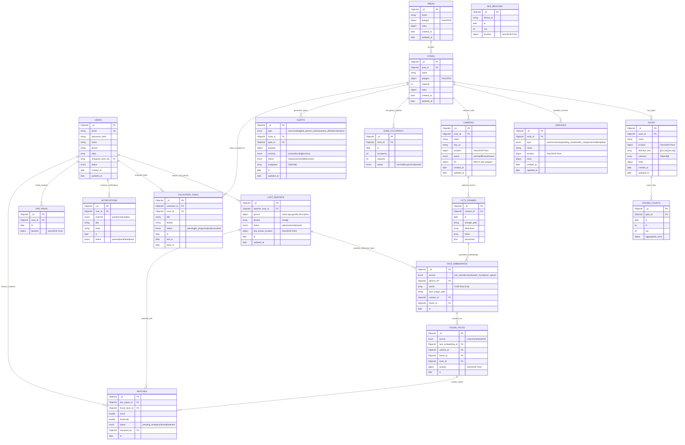
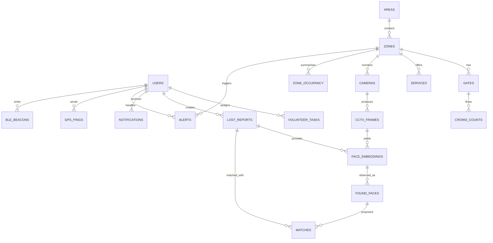
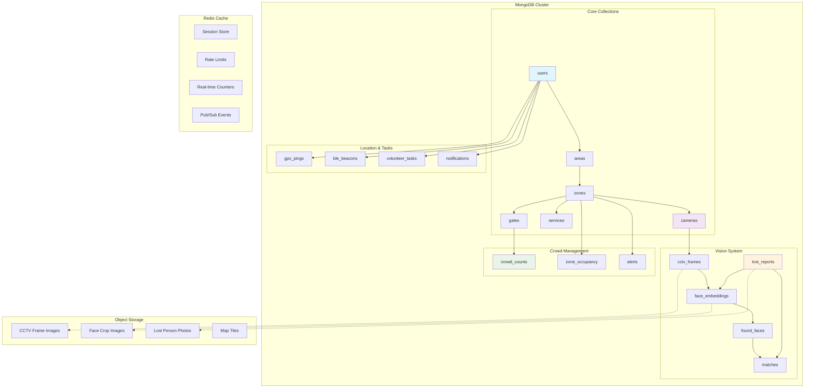
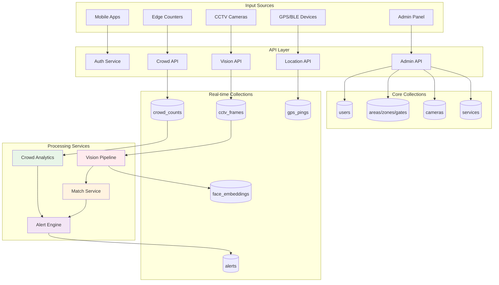
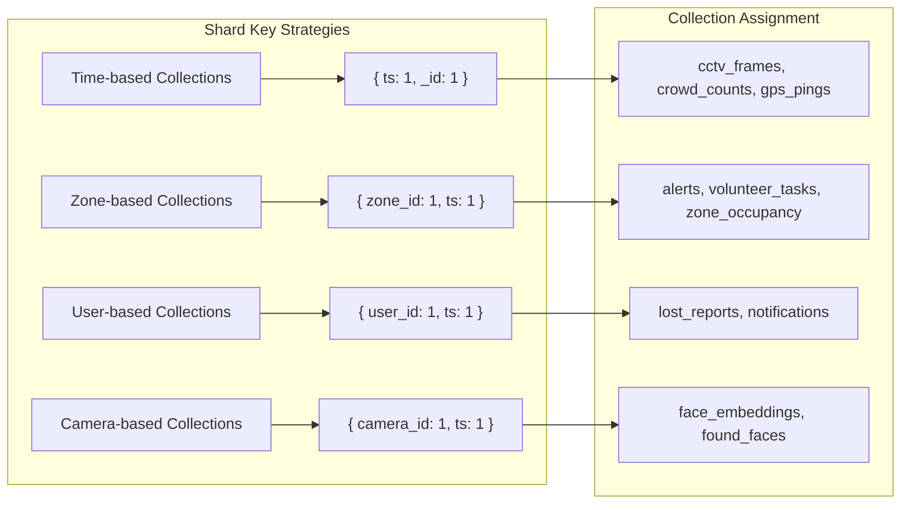

# Dhruv AI – Intelligent Crowd & Safety Management for MahaKumbh

**A single-file developer specification covering product scope, system architecture, MongoDB data model & ER diagram, APIs, AI/ML pipelines, deployment, and security.**

---

## 1) Executive Summary

Dhruv AI is a multi-tenant, role-based platform (Super Admin, Admin, Volunteer, User) for large-gathering management at MahaKumbh. It delivers:

- **Crowd Intelligence**: Real-time entry/exit counts per gate, zone capacities, live heatmaps from GPS + Bluetooth beacons.
- **Computer Vision**: CCTV ingestion; person detection; face detection & recognition for Lost & Found using YOLO + ArcFace/DeepFace embeddings.
- **Operations Map**: Admin-managed layers for services (washrooms, camps, health desks), cameras, gates/poles, congestion.
- **Alerting**: Overcrowding alerts, safety events, and lost-person matches to Admins & Volunteers; status tracking & workflows.
- **Apps**: Web (Super Admin/Admin), Mobile (User/Volunteer), Web dashboard for monitoring.

---

## 2) Stakeholders & Roles

- **Super Admin**: Manage tenants (if any), admins, global settings, policies.
- **Admin**: Configure Areas → Zones → Gates/Poles; services; cameras; dashboards; assign volunteers; respond to alerts; manage Lost & Found.
- **Volunteer**: Receive zone assignments, alerts, tasks; report found persons; file on-ground incident updates.
- **User (Pilgrim)**: Report lost person, view services map & crowding, opt-in location sharing, receive match notifications.

**RBAC Scopes (examples)**:
`super_admin:*`, `admin:*`, `volunteer:read`, `volunteer:write`, `user:read`, `lostfound:manage`, `cctv:read`, `cctv:ingest`, `map:edit`, `alert:ack`.

---

## 3) High-Level Architecture

### Core Services

1. **API Gateway** (FastAPI/Node): AuthN/Z, routing, rate-limiting.
2. **Admin Service**: Areas/Zones/Gates, services, cameras, assignments.
3. **CCTV Ingest Service**: RTSP pull, frame sampling, metadata, storage.
4. **Vision Service**: YOLO person/face detect → face crops → embeddings (ArcFace) → match service.
5. **Lost & Found Service**: Intake (user/volunteer), match orchestration, case lifecycle, notifications.
6. **Crowd Flow Service**: Gate counters, per-zone occupancy, thresholds & alerts.
7. **Location/Beacon Service**: GPS + BLE pings, tiling & heatmap generation.
8. **Notification Service**: Push (FCM/APNs), SMS, Email, WebSocket events.
9. **Realtime Hub**: WebSockets for dashboards & apps.
10. **Map/Tile Service**: Vector/heat tiles & layers.

### Data Stores

- **MongoDB (primary)**: operational data, embeddings, event logs (with TTL where applicable).
- **Redis**: counters, short-lived sessions, rate limits, pub/sub.
- **Object Storage (S3/GCS/MinIO)**: video segments, frame images, model artifacts, map tiles.

### Pipelines

- **CV Pipeline**: RTSP → frames → detect → face crop → embed → match → event.
- **Crowd Pipeline**: Person count at gate lines → entry/exit → zone occupancy → capacity alerts.
- **Location Pipeline**: GPS/BLE → grid/tile aggregator → heatmap layers.

---

## 4) MongoDB Data Model (Collections, Indexes, Schemas)

MongoDB is schemaless; we enforce JSON Schema validation per collection. All Geo fields use GeoJSON. All IDs are ObjectId unless stated.

### 4.1 users

**Purpose**: Auth identities for all roles.

```json
{
  "$jsonSchema": {
    "bsonType": "object",
    "required": ["email", "password_hash", "roles"],
    "properties": {
      "email": {"bsonType": "string", "pattern": "^.+@.+$"},
      "password_hash": {"bsonType": "string"},
      "name": {"bsonType": "string"},
      "phone": {"bsonType": "string"},
      "roles": {"bsonType": "array", "items": {"bsonType": "string"}},
      "assigned_zone_ids": {"bsonType": "array", "items": {"bsonType": "objectId"}},
      "status": {"enum": ["active", "suspended"]},
      "created_at": {"bsonType": "date"},
      "updated_at": {"bsonType": "date"}
    }
  }
}
```

**Indexes**:
- `{ email: 1 }` unique
- `{ roles: 1 }`
- `{ assigned_zone_ids: 1 }`

### 4.2 areas

```json
{
  "$jsonSchema": {
    "bsonType": "object",
    "required": ["name", "polygon"],
    "properties": {
      "name": {"bsonType": "string"},
      "polygon": {"bsonType": "object"},
      "meta": {"bsonType": "object"},
      "created_at": {"bsonType": "date"},
      "updated_at": {"bsonType": "date"}
    }
  }
}
```

**Indexes**: `{"polygon": "2dsphere"}`

### 4.3 zones

```json
{
  "$jsonSchema": {
    "bsonType": "object",
    "required": ["area_id", "name", "polygon", "capacity"],
    "properties": {
      "area_id": {"bsonType": "objectId"},
      "name": {"bsonType": "string"},
      "polygon": {"bsonType": "object"},
      "capacity": {"bsonType": "int", "minimum": 0},
      "meta": {"bsonType": "object"},
      "created_at": {"bsonType": "date"},
      "updated_at": {"bsonType": "date"}
    }
  }
}
```

**Indexes**: `{ area_id: 1 }`, `{"polygon": "2dsphere"}`

### 4.4 gates

```json
{
  "$jsonSchema": {
    "bsonType": "object",
    "required": ["zone_id", "name", "location", "direction_line"],
    "properties": {
      "zone_id": {"bsonType": "objectId"},
      "name": {"bsonType": "string"},
      "location": {"bsonType": "object"},
      "direction_line": {"bsonType": "array"},
      "cameras": {"bsonType": "array", "items": {"bsonType": "objectId"}},
      "meta": {"bsonType": "object"},
      "created_at": {"bsonType": "date"},
      "updated_at": {"bsonType": "date"}
    }
  }
}
```

**Indexes**: `{ zone_id: 1 }`, `{"location": "2dsphere"}`

### 4.5 services

**Purpose**: washroom, camp, waiting room, health camp, etc.

```json
{
  "$jsonSchema": {
    "bsonType": "object",
    "required": ["zone_id", "type", "name", "location"],
    "properties": {
      "zone_id": {"bsonType": "objectId"},
      "type": {"enum": ["washroom","camp","waiting_room","health_camp","restricted","helpdesk"]},
      "name": {"bsonType": "string"},
      "location": {"bsonType": "object"},
      "meta": {"bsonType": "object"},
      "created_at": {"bsonType": "date"},
      "updated_at": {"bsonType": "date"}
    }
  }
}
```

**Indexes**: `{ zone_id: 1, type: 1 }`, `{"location": "2dsphere"}`

### 4.6 cameras

```json
{
  "$jsonSchema": {
    "bsonType": "object",
    "required": ["zone_id", "name", "rtsp_url", "location"],
    "properties": {
      "zone_id": {"bsonType": "objectId"},
      "name": {"bsonType": "string"},
      "rtsp_url": {"bsonType": "string"},
      "location": {"bsonType": "object"},
      "status": {"enum": ["online","offline","unknown"]},
      "fov": {"bsonType": "object"},
      "created_at": {"bsonType": "date"},
      "updated_at": {"bsonType": "date"}
    }
  }
}
```

**Indexes**: `{ zone_id: 1 }`, `{"location": "2dsphere"}`

### 4.7 cctv_frames

**Purpose**: Metadata for sampled frames; images stored in object storage.

```json
{
  "$jsonSchema": {
    "bsonType": "object",
    "required": ["camera_id","ts","storage_path"],
    "properties": {
      "camera_id": {"bsonType": "objectId"},
      "ts": {"bsonType": "date"},
      "storage_path": {"bsonType": "string"},
      "detections": {"bsonType": "array", "items": {"bsonType": "object"}},
      "faces": {"bsonType": "array", "items": {"bsonType": "object"}},
      "processed": {"bsonType": "bool"}
    }
  }
}
```

**Indexes**: `{ camera_id: 1, ts: -1 }`, TTL optional on archival.

### 4.8 face_embeddings

**Purpose**: Store 512-D embeddings (ArcFace) with face crops.

```json
{
  "$jsonSchema": {
    "bsonType": "object",
    "required": ["source","vector","ts"],
    "properties": {
      "source": {"enum": ["lost_report","cctv","volunteer_found","user_upload"]},
      "person_ref": {"bsonType": "objectId"},
      "vector": {"bsonType": "array", "items": {"bsonType": "double"}, "minItems": 512, "maxItems": 512},
      "face_image_path": {"bsonType": "string"},
      "camera_id": {"bsonType": "objectId"},
      "frame_id": {"bsonType": "objectId"},
      "ts": {"bsonType": "date"}
    }
  }
}
```

**Indexes**: `{ ts: -1 }`, `{ source: 1 }`, optional vector index via MongoDB Atlas Vector Search on vector.

### 4.9 lost_reports

```json
{
  "$jsonSchema": {
    "bsonType": "object",
    "required": ["reporter_user_id","person","status","ts"],
    "properties": {
      "reporter_user_id": {"bsonType": "objectId"},
      "person": {
        "bsonType": "object",
        "required": ["name"],
        "properties": {
          "name": {"bsonType": "string"},
          "age": {"bsonType": "int"},
          "gender": {"enum": ["male","female","other","unknown"]},
          "description": {"bsonType": "string"}
        }
      },
      "photos": {"bsonType": "array", "items": {"bsonType": "string"}},
      "status": {"enum": ["open","matched","closed"]},
      "last_known_location": {"bsonType": "object"},
      "ts": {"bsonType": "date"},
      "updated_at": {"bsonType": "date"}
    }
  }
}
```

**Indexes**: `{ status: 1, ts: -1 }`, `{"last_known_location": "2dsphere"}`

### 4.10 found_faces

```json
{
  "$jsonSchema": {
    "bsonType": "object",
    "required": ["source","face_embedding_id","ts"],
    "properties": {
      "source": {"enum": ["cctv","volunteer","admin"]},
      "face_embedding_id": {"bsonType": "objectId"},
      "camera_id": {"bsonType": "objectId"},
      "frame_id": {"bsonType": "objectId"},
      "zone_id": {"bsonType": "objectId"},
      "location": {"bsonType": "object"},
      "ts": {"bsonType": "date"}
    }
  }
}
```

**Indexes**: `{ zone_id: 1, ts: -1 }`, `{"location": "2dsphere"}`

### 4.11 matches

```json
{
  "$jsonSchema": {
    "bsonType": "object",
    "required": ["lost_report_id","found_face_id","score","ts","status"],
    "properties": {
      "lost_report_id": {"bsonType": "objectId"},
      "found_face_id": {"bsonType": "objectId"},
      "score": {"bsonType": "double"},
      "threshold": {"bsonType": "double"},
      "status": {"enum": ["pending_review","confirmed","rejected"]},
      "reviewed_by": {"bsonType": "objectId"},
      "ts": {"bsonType": "date"}
    }
  }
}
```

**Indexes**: `{ lost_report_id: 1 }`, `{ status: 1, ts: -1 }`

### 4.12 crowd_counts

**Purpose**: Gate-level directional counts and aggregated zone occupancy.

```json
{
  "$jsonSchema": {
    "bsonType": "object",
    "required": ["gate_id","ts","in","out"],
    "properties": {
      "gate_id": {"bsonType": "objectId"},
      "ts": {"bsonType": "date"},
      "in": {"bsonType": "int"},
      "out": {"bsonType": "int"},
      "aggregated_zone": {"bsonType": "object"}
    }
  }
}
```

**Indexes**: `{ gate_id: 1, ts: -1 }` (time-bucketed), `{ ts: -1 }`

### 4.13 zone_occupancy

**Purpose**: Materialized current occupancy per zone.

```json
{
  "$jsonSchema": {
    "bsonType": "object",
    "required": ["zone_id","ts","occupancy"],
    "properties": {
      "zone_id": {"bsonType": "objectId"},
      "ts": {"bsonType": "date"},
      "occupancy": {"bsonType": "int"},
      "capacity": {"bsonType": "int"},
      "status": {"enum": ["normal","busy","critical","closed"]}
    }
  }
}
```

**Indexes**: `{ zone_id: 1 }`, `{ ts: -1 }`

### 4.14 gps_pings

```json
{
  "$jsonSchema": {
    "bsonType": "object",
    "required": ["user_id","ts","location"],
    "properties": {
      "user_id": {"bsonType": "objectId"},
      "ts": {"bsonType": "date"},
      "location": {"bsonType": "object"}
    }
  }
}
```

**Indexes**: `{ user_id: 1, ts: -1 }`, `{"location": "2dsphere"}`, TTL optional.

### 4.15 ble_beacons

```json
{
  "$jsonSchema": {
    "bsonType": "object",
    "required": ["device_id","ts","rssi","location"],
    "properties": {
      "device_id": {"bsonType": "string"},
      "ts": {"bsonType": "date"},
      "rssi": {"bsonType": "int"},
      "location": {"bsonType": "object"}
    }
  }
}
```

**Indexes**: `{ device_id: 1, ts: -1 }`, `{"location": "2dsphere"}`

### 4.16 volunteer_tasks

```json
{
  "$jsonSchema": {
    "bsonType": "object",
    "required": ["volunteer_id","zone_id","title","status","ts"],
    "properties": {
      "volunteer_id": {"bsonType": "objectId"},
      "zone_id": {"bsonType": "objectId"},
      "title": {"bsonType": "string"},
      "details": {"bsonType": "string"},
      "status": {"enum": ["pending","in_progress","done","cancelled"]},
      "ts": {"bsonType": "date"},
      "ack_ts": {"bsonType": "date"},
      "done_ts": {"bsonType": "date"}
    }
  }
}
```

**Indexes**: `{ volunteer_id: 1, status: 1 }`, `{ zone_id: 1 }`

### 4.17 alerts

```json
{
  "$jsonSchema": {
    "bsonType": "object",
    "required": ["type","zone_id","severity","ts","status"],
    "properties": {
      "type": {"enum": ["overcrowding","lost_person_match","camera_offline","incident","sos"]},
      "zone_id": {"bsonType": "objectId"},
      "gate_id": {"bsonType": "objectId"},
      "payload": {"bsonType": "object"},
      "severity": {"enum": ["low","medium","high","critical"]},
      "status": {"enum": ["new","ack","resolved","dismissed"]},
      "assignees": {"bsonType": "array", "items": {"bsonType": "objectId"}},
      "ts": {"bsonType": "date"},
      "updated_at": {"bsonType": "date"}
    }
  }
}
```

**Indexes**: `{ zone_id: 1, ts: -1 }`, `{ status: 1 }`, `{ type: 1 }`

### 4.18 notifications

```json
{
  "$jsonSchema": {
    "bsonType": "object",
    "required": ["user_id","channel","title","ts"],
    "properties": {
      "user_id": {"bsonType": "objectId"},
      "channel": {"enum": ["push","sms","email","ws"]},
      "title": {"bsonType": "string"},
      "body": {"bsonType": "string"},
      "ts": {"bsonType": "date"},
      "status": {"enum": ["queued","sent","failed","read"]}
    }
  }
}
```

**Indexes**: `{ user_id: 1, ts: -1 }`, `{ status: 1 }`

---

## 5) Database Schema Diagram & ER Relationships

### 5.1 Complete Database Schema Diagram



### 5.2 Simplified ER Diagram (Logical View)

For easier understanding, here's a simplified view focusing on key relationships:



### 5.3 Collection Dependencies & Foreign Keys

| Collection | Foreign Key Fields | References |
|-----------|-------------------|------------|
| `zones` | `area_id` | `areas._id` |
| `gates` | `zone_id`, `cameras[]` | `zones._id`, `cameras._id` |
| `services` | `zone_id` | `zones._id` |
| `cameras` | `zone_id` | `zones._id` |
| `cctv_frames` | `camera_id` | `cameras._id` |
| `face_embeddings` | `person_ref`, `camera_id`, `frame_id` | `lost_reports._id`, `cameras._id`, `cctv_frames._id` |
| `lost_reports` | `reporter_user_id` | `users._id` |
| `found_faces` | `face_embedding_id`, `camera_id`, `frame_id`, `zone_id` | `face_embeddings._id`, `cameras._id`, `cctv_frames._id`, `zones._id` |
| `matches` | `lost_report_id`, `found_face_id`, `reviewed_by` | `lost_reports._id`, `found_faces._id`, `users._id` |
| `crowd_counts` | `gate_id` | `gates._id` |
| `zone_occupancy` | `zone_id` | `zones._id` |
| `gps_pings` | `user_id` | `users._id` |
| `volunteer_tasks` | `volunteer_id`, `zone_id` | `users._id`, `zones._id` |
| `alerts` | `zone_id`, `gate_id`, `assignees[]` | `zones._id`, `gates._id`, `users._id` |
| `notifications` | `user_id` | `users._id` |

### 5.4 Index Strategy Summary

| Collection | Primary Indexes | Geospatial | Vector | TTL |
|-----------|----------------|------------|--------|-----|
| `users` | `email` (unique), `roles`, `assigned_zone_ids` | - | - | - |
| `areas` | - | `polygon` (2dsphere) | - | - |
| `zones` | `area_id` | `polygon` (2dsphere) | - | - |
| `gates` | `zone_id` | `location` (2dsphere) | - | - |
| `services` | `zone_id, type` | `location` (2dsphere) | - | - |
| `cameras` | `zone_id` | `location` (2dsphere) | - | - |
| `cctv_frames` | `camera_id, ts` | - | - | Optional |
| `face_embeddings` | `ts`, `source` | - | `vector` (Atlas) | - |
| `lost_reports` | `status, ts` | `last_known_location` (2dsphere) | - | - |
| `found_faces` | `zone_id, ts` | `location` (2dsphere) | - | - |
| `matches` | `lost_report_id`, `status, ts` | - | - | - |
| `crowd_counts` | `gate_id, ts`, `ts` | - | - | Optional |
| `zone_occupancy` | `zone_id`, `ts` | - | - | - |
| `gps_pings` | `user_id, ts` | `location` (2dsphere) | - | Optional |
| `ble_beacons` | `device_id, ts` | `location` (2dsphere) | - | Optional |
| `volunteer_tasks` | `volunteer_id, status`, `zone_id` | - | - | - |
| `alerts` | `zone_id, ts`, `status`, `type` | - | - | - |
| `notifications` | `user_id, ts`, `status` | - | - | - |

---

## 6) API Design (REST + WebSocket)

**Base URL**: `/api/v1`

### 6.1 Auth
- `POST /auth/register` (email, password, role?)
- `POST /auth/login`
- `POST /auth/refresh`
- `POST /auth/logout`
- `POST /auth/invite` (admin→volunteer)

### 6.2 Areas/Zones/Gates/Services
- `POST /areas`
- `GET /areas`
- `POST /zones` (body: area_id, polygon, capacity, name)
- `GET /zones?area_id=`
- `POST /gates` (zone_id, location, direction_line)
- `GET /gates?zone_id=`
- `POST /services` (zone_id, type, location, name)
- `GET /services?zone_id=&type=`

### 6.3 Cameras & CCTV
- `POST /cameras` (zone_id, name, rtsp_url, location, fov)
- `GET /cameras?zone_id=`
- `POST /cctv/frames` (ingest metadata; signed URL upload for image)
- `GET /cctv/frames?camera_id=&from=&to=`

### 6.4 Vision & Matching
- `POST /vision/detect` (image upload → returns detections, face crops)
- `POST /vision/embed` (face crop → returns vector id)
- `POST /vision/match` (vector id → list of candidate lost_reports with scores)

### 6.5 Lost & Found
- `POST /lost-reports` (photos[], person details, last_known_location)
- `GET /lost-reports?status=&q=`
- `POST /found-faces` (face_embedding_id, camera_id?, location)
- `GET /matches?status=`
- `POST /matches/:id/confirm` (admin)
- `POST /matches/:id/reject` (admin)

### 6.6 Crowd Flow & Occupancy
- `GET /crowd/gates/:gateId/counts?from=&to=`
- `GET /crowd/zones/:zoneId/occupancy`
- `POST /crowd/gates/:gateId/counter` (ingest from edge)

### 6.7 Location & Heatmap
- `POST /location/gps` (user_id, ts, point)
- `POST /location/ble` (device_id, ts, rssi, point)
- `GET /heatmap/tiles/{z}/{x}/{y}`

### 6.8 Volunteers & Tasks
- `POST /volunteers/assign` (user_id, zone_ids[])
- `GET /volunteers/:id/tasks?status=`
- `POST /tasks` (volunteer_id, zone_id, title)
- `POST /tasks/:id/ack`
- `POST /tasks/:id/done`

### 6.9 Alerts & Notifications
- `GET /alerts?zone_id=&status=&type=`
- `POST /alerts/:id/ack`
- `POST /alerts/:id/resolve`
- `GET /notifications?user_id=`

### 6.10 Map Layers
- `GET /map/layers` (services, cameras, gates, congestion)
- `GET /map/layers/crowd` (per zone status)

### 6.11 WebSocket Events (namespace /ws)
- `alert:new`, `alert:update`
- `lostfound:match`
- `crowd:zone_occupancy`
- `camera:status`
- `task:new`, `task:update`

**Standards**: JWT (access+refresh), OAuth2 password flow, Signed URLs for media, Idempotency-Key headers for writes, pagination via limit/next cursors.

---

## 7) AI/ML Pipelines

### 7.1 Vision: Lost & Found

1. **Detection (YOLOv8-face or RetinaFace)**:
   - Input: frames from `cctv_frames.storage_path`.
   - Output: face boxes; cropped face images.

2. **Embedding (ArcFace/FaceNet)**:
   - 512-D vector per face → store `face_embeddings`.

3. **Vector Search (Atlas Vector Search / FAISS sidecar)**:
   - Query CCTV embedding against lost person gallery embeddings from `lost_reports` photos.

4. **Scoring & Threshold**:
   - Cosine similarity; adjustable threshold per environment.

5. **Human-in-the-loop**:
   - Create `matches` (status pending_review). Admin confirms/rejects.

6. **Notifications**:
   - On confirmed, notify reporter + zone volunteers + admins.

**Model Registry**: store model versions & config in object storage + meta collection. Include calibration set & drift monitors.

### 7.2 Crowd Flow

- **Gate Line Counting**:
  - Virtual line (from `gates.direction_line`). Track object trajectories across line to label in vs out.
  - Aggregate per minute; write to `crowd_counts`.

- **Zone Occupancy**:
  - `occupancy(zone) = Σ in(gates) - Σ out(gates)` over rolling window.
  - Compare with `zones.capacity`; derive status (normal/busy/critical/closed).

- **Alerts**:
  - Generate alerts when occupancy crosses threshold; auto-resolve when below lower threshold (hysteresis).

### 7.3 Heatmap (GPS + BLE)

- **Ingestion**: users/volunteers opt-in → `gps_pings`, `ble_beacons`.
- **Tiling**: bin into tiles (e.g., WebMercator Z/X/Y) per N seconds.
- **Anonymization**: hash device IDs; minimum K-anonymity per tile before rendering.
- **Serving**: `GET /heatmap/tiles/{z}/{x}/{y}` returns raster/vector tile.

---

## 8) Data Flows (Sequence Summaries)

### Lost Report → Match
1. User submits lost report (+photo). → `lost_reports`, `face_embeddings` (gallery).
2. CCTV frames processed → `face_embeddings` (probe) → vector search → candidate list.
3. Create `matches(pending_review)` → Admin reviews → confirm/reject.
4. On confirm → alerts + notifications; case status → matched/closed.

### Overcrowding Alert
1. Edge counter posts minute counts to `crowd_counts`.
2. Crowd service recomputes `zone_occupancy` and status.
3. If threshold crossed → create `alerts` + push WS to Admin & Volunteers in zone.

### Volunteer Task
1. Admin assigns task → `volunteer_tasks(pending)`.
2. Volunteer receives WS/push → ack.
3. Volunteer completes → done → Admin dashboard updates.

---

## 9) Security, Privacy & Compliance

- **Auth**: JWT access+refresh; password hashing (Argon2/bcrypt); MFA optional.
- **RBAC**: route-level & record-level checks; zone-scoped access for volunteers.
- **PII & Face Data**: consent for uploads; retention policies; encryption at rest (MongoDB Encrypted Storage) and in transit (TLS).
- **Media Security**: signed URLs; segregated buckets for raw frames vs face crops.
- **Anonymization**: BLE/GPS pings pseudonymized; K-anonymity threshold for tiles; opt-out support.
- **Audit Logs**: admin actions, match decisions, alert resolutions.

---

## 10) Deployment & DevOps

- **Containers**: Docker images per service;
- **Orchestration**: Kubernetes; Horizontal Pod Autoscalers; node pools for GPU (vision).
- **CI/CD**: Build, unit/integration tests; canary for vision model updates.
- **Observability**: Prometheus metrics, Grafana dashboards, ELK/Opensearch logs, tracing (OTel).
- **Configs**: 12-Factor; environment secrets via Vault/Secrets Manager.
- **Scaling Tips**:
  - Vision workers autoscale on queue depth.
  - Vector search: use Atlas Search or external FAISS service with sharding.
  - Frame sampling rate adaptive to camera load.

---

## 11) Example Documents (Snippets)

### Gate
```json
{
  "zone_id": "66f1c0...",
  "name": "Gate 9",
  "location": {"type":"Point","coordinates":[78.1234, 21.5678]},
  "direction_line": [[78.1233,21.5677],[78.1235,21.5679]],
  "cameras": ["66f1c1..."],
  "meta": {"note": "north entrance"}
}
```

### Lost Report
```json
{
  "reporter_user_id": "66f1d2...",
  "person": {"name":"Rahul", "age": 12, "gender": "male", "description":"blue shirt"},
  "photos": ["s3://bucket/lost/abc.jpg"],
  "status": "open",
  "last_known_location": {"type":"Point","coordinates":[78.11,21.56]},
  "ts": "2025-08-29T12:30:00Z"
}
```

### Match
```json
{
  "lost_report_id": "66f1e3...",
  "found_face_id": "66f1e8...",
  "score": 0.84,
  "threshold": 0.8,
  "status": "pending_review",
  "ts": "2025-08-29T12:36:10Z"
}
```

---

## 12) Aggregations & Indexing Patterns

- **Zone occupancy (latest)**:
```javascript
[
  { $sort: { zone_id: 1, ts: -1 } }, 
  { $group: { _id: "$zone_id", doc: { $first: "$$ROOT" } } }
]
```

- **Heatmap tile read**: precompute and cache by (z/x/y, timebucket).
- **Vector search**: Atlas Vector Search index on `face_embeddings.vector`.
- **Geospatial**: ensure 2dsphere on all Point/Polygon fields; use `$geoWithin`, `$near` for queries.

---

## 13) Edge & Offline Considerations

- **Volunteer App**: offline-first task queue; sync when online.
- **Edge Gate Counters**: run on Jetson/RPi; send signed requests with device keys; retry with backoff.
- **Clock Skew**: NTP sync on edge devices to keep counts accurate.

---

## 14) Non-Functional Requirements

- **Latency**: < 2s for WS alert fanout; < 5s for crowd status update.
- **Throughput**: 100+ cameras, 10 FPS sampling → adaptive sampling to 1–2 FPS for CV.
- **Availability**: 99.5% during event; HA replicas.
- **Data Retention**: frames 7–30 days; embeddings 90 days; logs 180 days (configurable).

---

## 15) UI/UX Wireframe Notes (brief)

- **Admin Dashboard**: map center, left: layers; right: alerts; bottom: camera strip.
- **Volunteer App**: My Zone card → Active Alerts → Tasks → Report Found → SOS.
- **User App**: Report Lost CTA → Map (services + heatmap) → Alerts.

---

## 16) Environment Configuration (sample)

```bash
MONGO_URI=
JWT_SECRET=
OBJECT_STORE_ENDPOINT=
OBJECT_STORE_BUCKET=
VECTOR_SEARCH=atlas|faiss
RTSP_PULL_WORKERS=8
FACE_MATCH_THRESHOLD=0.8
TILE_TIME_BUCKET_SECONDS=60
```

---

## 17) Testing Strategy

- **Unit**: schema validators, RBAC guards, match scoring.
- **Integration**: end-to-end lost→match flow with synthetic data.
- **Load**: simulated camera feeds; tile generation under 10k pings/min.
- **Field Trials**: dry run on subset of zones; calibrate thresholds.

---

## 18) Roadmap (Phases)

1. **MVP**: Areas/Zones/Gates; Cameras; Gate counting; Lost reports; Manual review.
2. **Phase 2**: Vector search, auto-match; heatmap tiles; volunteer tasks; alerts.
3. **Phase 3**: Advanced analytics, multilingual UX, SOS workflows, offline-first volunteers.

---

## 19) Glossary

- **Gate Line**: Virtual line used to classify entering vs exiting trajectories.
- **Gallery vs Probe**: Gallery = known lost-person embeddings; Probe = CCTV-derived.
- **K-Anonymity**: Do not display tiles with fewer than K unique devices.

---

## 20) Database Architecture & Visual Schema

### 20.1 Database Physical Architecture



### 20.2 Data Flow Architecture



### 20.3 Collection Size & Growth Estimates

| Collection | Doc Size (avg) | Daily Growth | Retention | Est. Total Size |
|-----------|----------------|--------------|-----------|----------------|
| `users` | 1KB | 1K docs | Permanent | 365MB/year |
| `areas` | 2KB | 10 docs | Permanent | Minimal |
| `zones` | 3KB | 100 docs | Permanent | Minimal |
| `gates` | 1.5KB | 500 docs | Permanent | 1MB |
| `services` | 1KB | 200 docs | Permanent | 200KB |
| `cameras` | 2KB | 100 docs | Permanent | 200KB |
| `cctv_frames` | 500B | 8.6M docs | 30 days | 120GB |
| `face_embeddings` | 4KB | 100K docs | 90 days | 35GB |
| `lost_reports` | 3KB | 1K docs | 1 year | 1GB |
| `found_faces` | 1KB | 10K docs | 90 days | 900MB |
| `matches` | 500B | 500 docs | 1 year | 180MB |
| `crowd_counts` | 200B | 720K docs | 30 days | 4.3GB |
| `zone_occupancy` | 300B | 144K docs | 30 days | 1.3GB |
| `gps_pings` | 200B | 10M docs | 7 days | 14GB |
| `alerts` | 1KB | 1K docs | 90 days | 90MB |

**Total MongoDB Storage**: ~175GB (with retention policies)

### 20.4 Sharding Strategy



---

**END OF SPECIFICATION**
